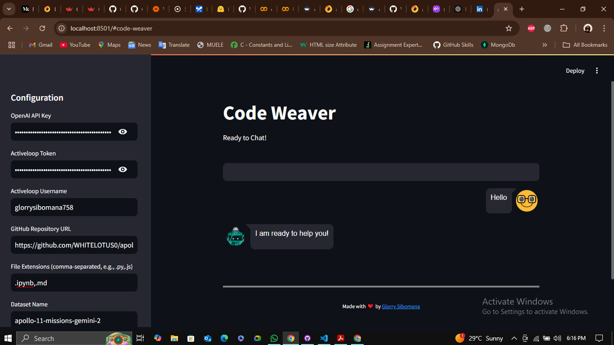

# Code Weaver

This application is inspired by the [Chat-with-Github-Repo](https://github.com/peterw/Chat-with-Github-Repo) project by peterw, which demonstrates how to create a chatbot using Streamlit, OpenAI, and Activeloop's Deep Lake. Code Weaver builds upon that foundation, offering a more user-friendly experience and optimized performance.

Code Weaver is designed to let you interact with a GitHub repository through a conversational interface. It indexes the contents of a repository, allowing you to ask questions and receive answers based on the repository's documentation and code.



## Key Improvements Over Original Implementation

Code Weaver offers several key improvements that enhance the user experience and the app's overall performance:

*   **Purely Frontend UI:**
    *   The original application used a command-line interface (CLI) for configuration. Code Weaver provides a completely UI-based experience. All configurations (API keys, repo URLs, dataset names, etc.) are entered directly into the Streamlit app, making it much more accessible to users.
*   **Optimized Document Parsing:**
    *   The document parsing and splitting process have been optimized for speed and handling of large files by using `RecursiveCharacterTextSplitter`.
*   **Improved Loading times:**
     * The app is now faster because the embeddings are not recalculated each time the app is started, this is achieved by using `InMemoryCache`.
*   **Direct OpenAI Embeddings Model:**
    *   The app now directly specifies the usage of the `"text-embedding-ada-002"` OpenAI embedding model, resulting in faster embedding calculations.
*   **In Memory Cache:**
    *   `InMemoryCache` is used to cache the results from the language model improving loading speeds.
*   **Streamlined Setup:**
    *   No more need for `.env` files, as all necessary variables are inserted directly in the app UI.
*    **Easier Deployment**: The app is built to be deployed in Hugging Face Spaces, making the deployment process easier.

## How to Use Code Weaver

1.  **Clone the repository:**
     ```bash
     git clone https://github.com/your-username/your-repo-name.git
     ```
2.  **Navigate to the Project Directory:**

    ```bash
    cd your-repo-name
    ```
3.  **Install dependencies:**

    ```bash
    pip install -r requirements.txt
    ```
4.  **Run the app:**
    ```bash
    streamlit run app.py
    ```

5.  **Enter configurations**: The Streamlit app will open in your web browser. In the sidebar, provide:
    *   Your OpenAI API Key
    *   Your Activeloop Token
    *   Your Activeloop Username
    *   The GitHub repository URL you want to explore
    *   The file extensions to include (optional)
    *   A desired name for the DeepLake dataset
6.  **Process the repository**: Click on the "Process Repository" Button, and wait for it to finish.
7.  **Start Chatting:** After processing is done, you can start asking questions about the repository in the provided input text area.

## Contributing

Contributions to this project are always welcome. If you find any bugs or would like to suggest new features, feel free to create a pull request or open an issue in this repository.

## Credits

*   Inspired by the [Chat-with-Github-Repo](https://github.com/peterw/Chat-with-Github-Repo) project by peterw.
*   Built using Python, Streamlit, OpenAI, Activeloop, and Langchain.

## License

[MIT License](LICENSE)